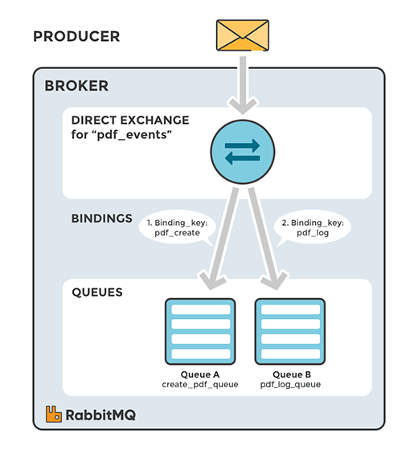
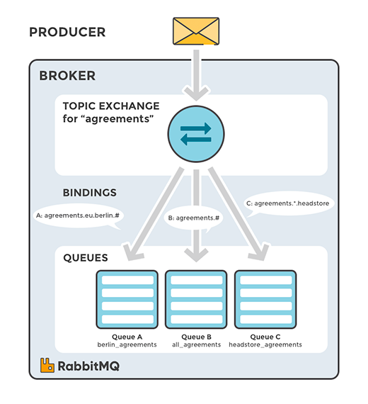
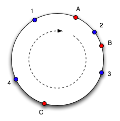
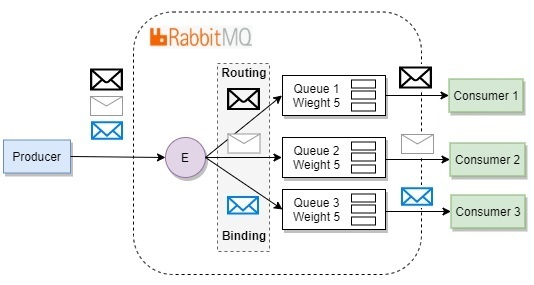
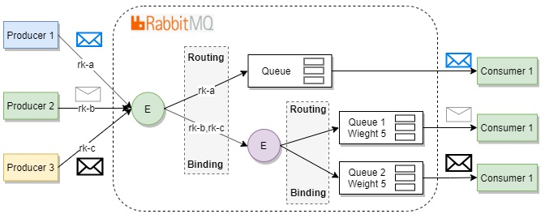

# Using RabbitMQ

---

# What do I expect?

 - You should remember the basics about messaging from the previous talk
 - You should be _at least_ confortable with the concepts
 - You should be _at least_ confortable with Python or Javascript
 - You **want** to learn

---

> You publish to an exchange but consume from a queue

You should know this very well by now

---

# What are we going to cover?

 - **Exchanges** a lot of them, with examples of usage
 - **Remember** the theory from the previous presentation so with the examples its clear what they meant

---

# Exchanges and queues

 - Exchanges know **nothing** about queues
 - Queues know **nothing** about exchanges

---

So to receive a message, a queue needs to _bind_ to an exchange, **always**

There is actually an exception, but in reality binding it is done _under the hood_ for us

---

 - An Exchange does _nothing_ until is bound
 - A Queue gets _nothing_ until is bound
 - When bound, _sometimes_ we need a qualifier for routing, the `routing_key`

---

 - An Exchange controls the rules of _distribution_
 - A Queue controls the rules of _consumption_

---

# Libraries used

 - Python: `aio-pika` for asynchronous messaging using `asyncio`
 - Javascript: `amqplib` for general usage

---

# Exchanges

---

 > An Exchange controls the rules of _distribution_

---

 > You _publish_ to an exchange...

---

# Direct exchange

 - The routing key must match exactly with the bound key
 - The routing key **has absolutely nothing** to do with the name of the queue
 - It **does** require binding

---

---

# Default exchange

 - It is rarely used besides examples
 - The routing key **is** the name of the consumer queue
 - It **does not** require binding

---

# Topic Exchange

 - The routing key can _partially match_ the bound key
 - The _topic_ is a set of words delimited by period (`.`)
 - It **does** requires binding
 - We can bind to match _any_ word (`#`)
 - We can bind to match _none or more_ words (`*`)

---

---

# Fanout Exchange

 - It **does** requires binding
 - A routing key **is not required** at binding (any routing key is ignored)
 - Everybody who is bound to it will receive the same message

---

# Headers Exchange

 - It **does** requires binding
 - Routing key is ignored at binding
 - It requires _what headers_ should be bound
 - `any` is an `OR` operation
 - `all` is an `AND` operation
 - Headers starting with `x-` cannot be bound

---

# Consistent hash exchange

Do you remember hash tables from algorithms and data structures?

---

It goes a little beyond that, using a ring of nodes as _buckets_ so it doesn't depend on knowing the number of nodes for calculating the location[^3]

[^3]: http://tom-e-white.com/2007/11/consistent-hashing.html
---

In RabbitMQ

 - You have to enable the Consistent Hash Exchange plugin, it is not enabled by default
 - The routing key _in the exchange_ means absolutely nothing (if you are not hashing it)
 - The routing key _in the binding_ means the **weight** for the association in the hashing circle
 - Sometimes it will look random (and it is, by definition) but it is _consistent_ in its distribution
 - You can use the hash of a **header value** or the hash **of the routing key**
 - This system is usually used to distribute the load between consumers in a _fairer_ way

---

---

# Exchange to Exchange

 - It works exactly like binding against a queue, but instead, you bind an exchange to another
 - Super useful to create complex topologies, for example, an original exchange is of type `topic` but you need to consume it using fanout or consistent hash
 - As with the queue, the routing key in the binding depends on the source exchange type

---

---

# Accepting and rejecting

 - `ack` marks the message as succesfully processed
 - `reject` marks the message as faulty, something happened while processing it
 - `nack` is like reject, but returns the message at the _head_ of the queue
 - In reality, `nack` is `reject` with `requeue` set as True
 - What if you want to `nack` the message _at the tail_ of the queue?

---

# Prefecting

The Prefetch parameter controls _how many_ messages we will give to each consumer at the same time

 - Higher values favors throughoutput, consumers where the order doesn't matter and needs high throughoutput should set this parameter high
 - We can prefetch by number of messages of _size_ of messages
 - Be careful with messages where order is important

---

# RPC (synchronous) messaging

It is possible to emulate synchronous calling using a messaging system!

---

# Other libraries and observation

 - In JavaScript many implementors use Rascal instead of naked amqplib
 - You can wrap your own custom usage of aio-pika in your own library (see `Hase`)
 - Use the language and library that suits you more _for the implementation you require_
 - Simplicity is important
 